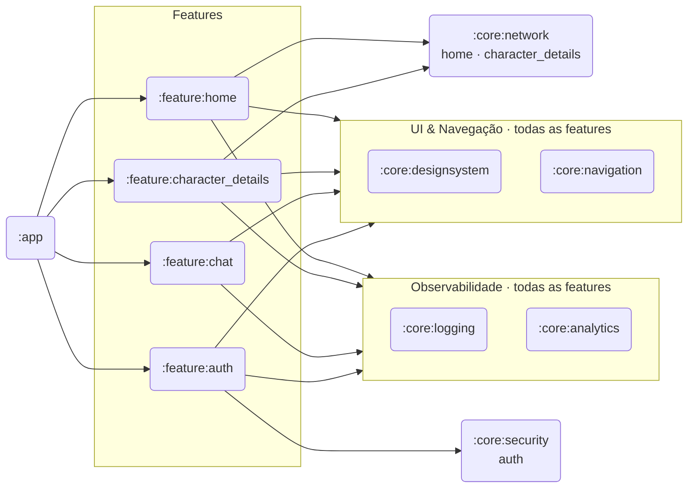
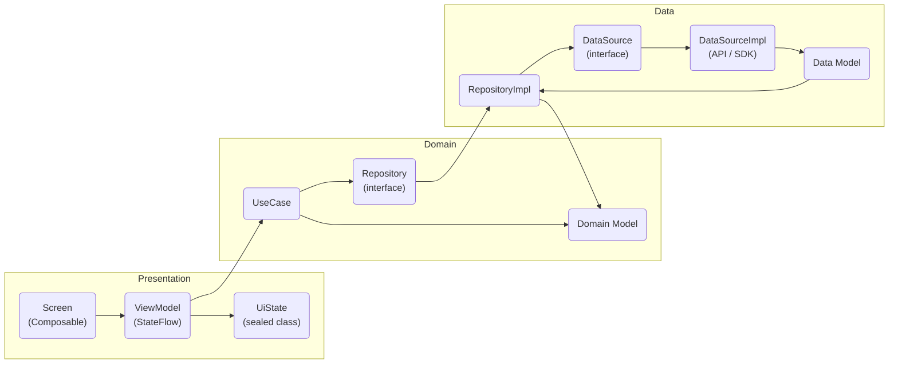

# Arquitetura

## Visão dos módulos

Cada módulo `:feature:*` é uma biblioteca Android independente. O `:app` é o único que conhece todos os módulos e faz a composição via Koin e Navigation Compose.

## Camadas internas (por feature)

Cada feature segue Clean Architecture com três camadas:

A camada **domain** não conhece nada de Android ou de frameworks externos — só Kotlin puro. A camada **data** implementa os contratos definidos no domain. A camada **presentation** só depende do domain via use cases.

## Injeção de dependências (Koin)

Os módulos Koin são declarados em `:app` e em cada feature com `di/`:

| Módulo Koin | Onde está | O que registra |
|-------------|-----------|----------------|
| `networkModule` | `:app` | `Retrofit` singleton, `RickAndMortyApiService` |
| `loggingModule` | `:core:logging` | `AppLogger` singleton |
| `analyticsModule` | `:core:analytics` | `AnalyticsTracker`, `PerformanceTracker` |
| `securityModule` | `:core:security` | `SecureStorage` singleton (EncryptedSharedPreferences) |
| `keysModule` | `:app` | `geminiApiKey` como named qualifier |
| `homeModule` | `:feature:home` | datasource, repository, use case, mapper, ViewModel |
| `characterDetailsModule` | `:feature:character_details` | datasources, repositories, use cases, ViewModels |
| `chatModule` | `:feature:chat` | `GenerativeModel`, datasource, repository, use cases, ViewModel |
| `authModule` | `:feature:auth` | `AuthRepository`, `LoginUseCase`, `LoginViewModel` |

## Navegação

Declarada em `MainActivity` com Navigation Compose. As rotas ficam centralizadas em `NavDestination` (`:core:navigation`):

| Destino | Rota | Parâmetro |
|---------|------|-----------|
| Login | `login` | — |
| Home | `home?query={query}` | `query: String` (opcional, default `""`) |
| Chat | `chat` | — |
| Detail | `detail/{itemId}` | `itemId: Int` |

**Fluxo:** `Login → Home` usa `popUpTo(Login) { inclusive = true }` — o botão Voltar em Home não retorna ao Login.

## Design System

Todos os tokens de UI ficam em `:core:designsystem`:

- **ColorTokens** — paleta sci-fi dark/light
- **SpacingTokens** — escala de espaçamento
- **TypographyTokens** — escala tipográfica
- **ShapeTokens** — raios de borda
- **ElevationTokens** — níveis de elevação Material 3
- **AnimationTokens** — durações e easings padronizados

Componentes reutilizáveis: `CardCharacter`, `CardCharacterSkeleton`, `SearchToolbar`, `StatusBadge`, `DialogError`, `Toolbar`.

## Rede

`NetworkClient` (`:core:network`) configura o Retrofit com:
- Base URL: `https://rickandmortyapi.com/api/`
- `GsonConverterFactory`
- `HttpLoggingInterceptor` (body)
- `ResilienceInterceptor` (retry logic)

O singleton `Retrofit` é compartilhado entre `:feature:home`, `:feature:character_details` e `:feature:chat` via Koin.

---

## Por que modularizar? Benefícios a longo prazo

A maioria dos projetos Android começa como um único módulo (`:app`). A migração para multi-módulo tem custo inicial real — mais arquivos de build, mais regras de dependência, mais disciplina. O retorno aparece à medida que o projeto cresce.

### Build incremental e paralelo

O Gradle só recompila módulos cujo código mudou. Em um projeto monolítico, qualquer alteração potencialmente recompila tudo. Com módulos separados, mudar `:feature:chat` não toca `:feature:home`, `:core:designsystem` ou `:core:network`.

Em builds de CI, módulos independentes são compilados em paralelo — o tempo total cai proporcionalmente ao número de módulos sem dependência entre si.

| Cenário | Monólito | Multi-módulo |
|---------|----------|-------------|
| Mudança em uma feature | Recompila tudo | Recompila só a feature afetada |
| Build de CI | Sequencial | Paralelo onde possível |
| Rebuild após mudança em `core` | Tudo | Só os módulos que dependem desse core |

### Fronteiras que o compilador enforce

Em um monólito, `ViewModel` de `Home` pode importar código de `CharacterDetails` acidentalmente — o compilador não reclama. Com módulos separados, o grafo de dependências é explícito: se `:feature:home` não declara `:feature:chat` como dependência, não há como importar código de lá.

Isso elimina uma categoria inteira de bugs arquiteturais que em projetos grandes só aparecem quando a base de código já está acoplada.

### Testabilidade por camada

Cada módulo tem seus próprios testes unitários que rodam isolados. `:core:security` testa `SecureStorage` sem precisar de `:feature:auth`. `:feature:home` testa `HomeViewModel` sem nada de chat ou autenticação.

O resultado prático: a suíte de testes é mais rápida (menos setup) e falhas são mais fáceis de localizar (se o teste de `home` quebra, o problema está em `home`).

### Escalabilidade de time

Em times maiores, módulos mapeiam naturalmente para propriedade de código. A squad de autenticação tem dono claro sobre `:feature:auth` e `:core:security`. Mudanças em um módulo raramente causam conflito de merge com o trabalho de outra squad.

Em projetos com um único módulo, a mesma pasta `presentation/` vira território de todos — e de ninguém.

### Reusabilidade real

`:core:designsystem`, `:core:logging`, `:core:analytics` e `:core:security` foram escritos uma vez e são consumidos por qualquer feature existente ou futura. Em um monólito, essa reutilização ainda é possível tecnicamente, mas a disciplina precisa vir de convenções de time — não de regras de compilação.

### O custo é real — e quando vale

A modularização tem overhead: cada módulo novo tem `build.gradle.kts`, `AndroidManifest.xml`, e regras de dependência para manter. Para projetos pequenos com um único desenvolvedor e escopo fixo, o custo pode superar o benefício.

O ponto de inflexão costuma ser quando:
- O build começa a demorar mais do que alguns minutos
- Mais de uma pessoa trabalha em features diferentes simultaneamente
- Há código que claramente deveria ser compartilhado mas acaba duplicado por convenção, não por compilador

---

## Esta arquitetura em um app de produção com milhões de usuários

O projeto é educacional, mas as decisões arquiteturais refletem exatamente o que o Google recomenda para apps Android em produção — com argumentos que ficam mais fortes, não mais fracos, conforme a escala cresce.

### Clean Architecture: regras de negócio que não quebram com mudança de infraestrutura

A separação em Domain → Data → Presentation significa que as regras de negócio (UseCases) não conhecem Retrofit, Room, Firebase ou qualquer SDK externo. Quando um app chega a milhões de usuários, a infraestrutura muda com frequência: troca de CDN, migração de banco, novo backend de analytics. Clean Architecture garante que essas mudanças não quebrem a lógica de negócio.

**No projeto:** `LoginUseCase` valida credenciais sem saber que o repositório usa `delay()` hoje — amanhã poderia usar uma chamada real de rede sem tocar no UseCase.

> "Separation of concerns is the most important principle to follow when designing your app architecture."
> — [Guide to app architecture · Google](https://developer.android.com/topic/architecture)

### Modularização: o que o Gradle não compila não atrasa o build

Em um app com dezenas de features e um time de 50+ engenheiros, o tempo de build é um KPI de produtividade. Módulos independentes são compilados em paralelo pelo Gradle e, mais importante, **não são recompilados quando não mudaram**.

A Google usa exatamente essa estratégia no Now in Android — o app de referência deles — que tem mais de 20 módulos, compilados com Gradle Configuration Cache e Build Cache habilitados.

**No projeto:** mudar `:feature:auth` não retoca `:feature:chat`, `:core:designsystem` nem `:core:network`.

Além disso, modularização habilita o **Play Feature Delivery**: features podem ser entregues sob demanda pelo Play Store, reduzindo o tamanho do APK inicial — crítico para usuários com dispositivos de entrada ou conexões lentas.

> "Modularization is a practice of organizing a codebase into loosely coupled and self contained parts. Each part is a module. Each module is independent and serves a clear purpose."
> — [Guide to Android app modularization · Google](https://developer.android.com/topic/modularization)

### Interface-first: troca de infraestrutura sem tocar nas features

`AppLogger`, `AnalyticsTracker`, `PerformanceTracker` e `SecureStorage` são interfaces. As features nunca importam `Log.d()`, `FirebaseAnalytics` ou `EncryptedSharedPreferences` diretamente.

Em produção, esse padrão vale muito:

| Interface | Hoje (estudo) | Em produção |
|-----------|--------------|-------------|
| `AnalyticsTracker` | `LogcatAnalyticsTracker` | `FirebaseAnalyticsTracker` |
| `PerformanceTracker` | `LogcatPerformanceTracker` | `FirebasePerformanceTracker` |
| `AppLogger` | `LogcatLogger` | `CrashlyticsLogger` |
| `SecureStorage` | `EncryptedPrefsStorage` | `EncryptedDataStoreStorage` |

Cada troca é **uma nova classe + uma linha no Koin**. As 4 features não mudam.

> "We recommend that you code to interfaces for the repositories, data sources and other classes in your app. This way you can swap implementations for testing and in future features."
> — [Architecture recommendations · Google](https://developer.android.com/topic/architecture/recommendations)

### StateFlow + sealed UiState: sem estado ambíguo em produção

`Loading`, `Success`, `Error` são estados mutuamente exclusivos representados por tipos — não por combinações de booleans (`isLoading = true`, `hasError = false`, `data = null`). Isso elimina estados impossíveis como `isLoading = true && hasError = true`.

Em escala, isso importa para rastreamento de bugs: um evento de analytics disparado em `LoginUiState.Error` sempre carrega a mensagem de erro. Não há campo nullable que esqueceu de ser preenchido.

> "We recommend modeling UI state as a sealed class when there are a small number of different states."
> — [UI layer · Google](https://developer.android.com/topic/architecture/ui-layer/stateholders)

### Paging 3: paginação em escala sem carregar a lista inteira

`:feature:home` usa Paging 3 para carregar personagens. Com milhões de registros no backend, a única abordagem viável é paginação — carregar a lista completa em memória causaria OOM (out of memory) em dispositivos de entrada.

O Paging 3 integra com `LazyColumn`/`LazyVerticalGrid` do Compose, gerencia cache, retry e estado de loading de cada página de forma independente.

> "The Paging library helps you load and display pages of data from a larger dataset from local storage or over network."
> — [Paging 3 overview · Google](https://developer.android.com/topic/libraries/architecture/paging/v3-overview)

### Segurança com Android Keystore: o padrão para tokens em produção

`:core:security` usa `EncryptedSharedPreferences` com chave mestra gerada pelo **Android Keystore**. A chave nunca sai do hardware seguro (TEE/SE) — mesmo que o arquivo de preferências seja extraído, os dados são ilegíveis sem a chave de hardware.

Essa é a recomendação explícita do Google para armazenar tokens de acesso, credenciais e dados sensíveis em apps Android. Em produção, o mesmo padrão seria usado para tokens OAuth e refresh tokens.

> "Use the Android Keystore system to store cryptographic keys in a container to make it more difficult to extract from the device."
> — [Android Keystore System · Google](https://developer.android.com/privacy-and-security/keystore)

### O que precisaria evoluir para produção real

Esta arquitetura está pronta para as evoluções críticas de escala sem reescrita:

| Necessidade em produção | Caminho de evolução | Impacto no código atual |
|------------------------|--------------------|-----------------------|
| Offline-first | Room + repositório offline-first (mesmo contrato de interface) | Só a implementação do repositório |
| Analytics de produção | `FirebaseAnalyticsTracker` implementando `AnalyticsTracker` | Uma classe nova, uma linha no Koin |
| Auth real (OAuth) | `AuthRepositoryImpl` chamando API real | O `LoginUseCase` não muda |
| Performance de startup | Baseline Profiles por módulo | Configuração de build, sem toque em código |
| Features sob demanda | Play Feature Delivery com módulos dinâmicos | Configuração de módulo, sem refatoração |
| Background sync | WorkManager chamando os mesmos UseCases | Nova camada de agendamento, domínio intacto |

---

## Referências oficiais do Google

| Referência | O que cobre |
|-----------|------------|
| [Guide to app architecture](https://developer.android.com/topic/architecture) | Princípios de Clean Architecture para Android — camadas, UDF, recomendações |
| [Modularization guide](https://developer.android.com/topic/modularization) | Estratégias de modularização, tipos de módulo, when to modularize |
| [Architecture recommendations](https://developer.android.com/topic/architecture/recommendations) | Lista prescritiva de boas práticas por camada |
| [Now in Android](https://github.com/android/nowinandroid) | App de referência do Google — multi-módulo, Compose, MVI em produção |
| [UI layer](https://developer.android.com/topic/architecture/ui-layer) | StateFlow, sealed UiState, UDF (Unidirectional Data Flow) |
| [Data layer](https://developer.android.com/topic/architecture/data-layer) | Repositórios, fontes de dados, interface-first |
| [Paging 3](https://developer.android.com/topic/libraries/architecture/paging/v3-overview) | Paginação em escala integrada com Compose |
| [Android Keystore System](https://developer.android.com/privacy-and-security/keystore) | Armazenamento seguro de chaves criptográficas |
| [Jetpack Security](https://developer.android.com/jetpack/androidx/releases/security) | EncryptedSharedPreferences e EncryptedFile |
| [Baseline Profiles](https://developer.android.com/topic/performance/baselineprofiles) | Otimização de startup e performance por módulo |
| [Play Feature Delivery](https://developer.android.com/guide/playcore/feature-delivery) | Entrega de features sob demanda para reduzir APK inicial |
| [WorkManager](https://developer.android.com/topic/libraries/architecture/workmanager) | Background sync garantido, compatível com Doze e App Standby |

---

## Veja também

- [Core: Observabilidade](Core-Observabilidade) — logging, analytics e performance tracking integrados em cada feature
- [Core: Security](Core-Security) — EncryptedSharedPreferences e Android Keystore
- [Core: Navigation](Core-Navigation) — rotas centralizadas e NavDestination
- [Core: Network](Core-Network) — cliente HTTP, retry e tratamento de erros
- [Feature: Auth Simulada](Feature-Auth-Simulada) — exemplo completo de Clean Architecture por camada
- [Testes de UI](Testes-de-UI) — estratégia de testes por módulo
- [Documentação de Engenharia](Documentação-de-Engenharia) — ADRs, specs e por que essa arquitetura escala