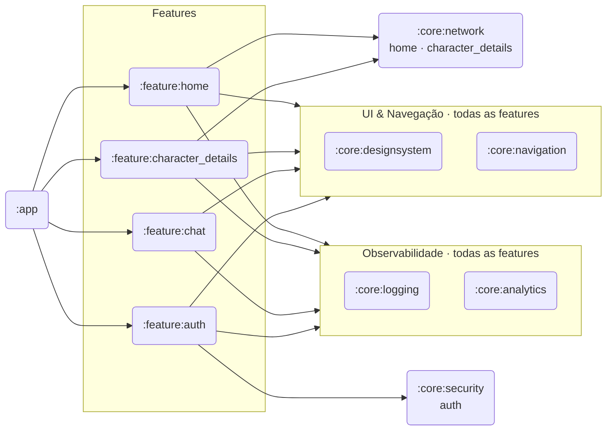
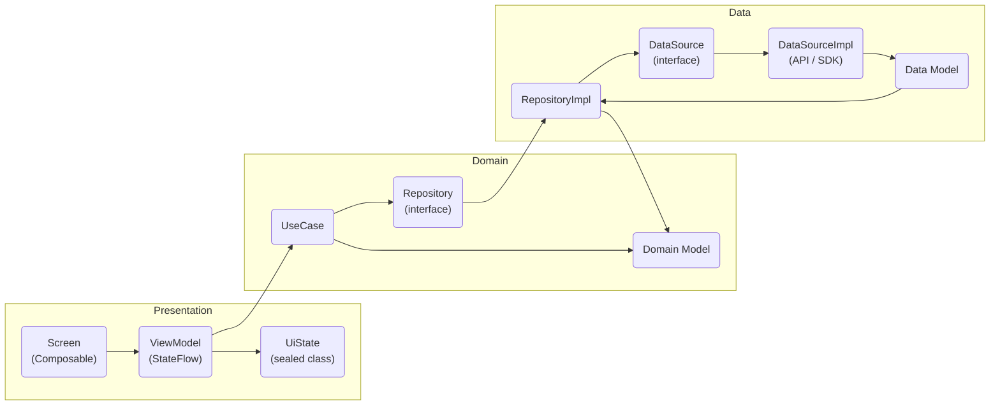

# Arquitetura

## Visão dos módulos

Cada módulo `:feature:*` é uma biblioteca Android independente. O `:app` é o único que conhece todos os módulos e faz a composição via Koin e Navigation Compose.

## Camadas internas (por feature)

Cada feature segue Clean Architecture com três camadas:

A camada **domain** não conhece nada de Android ou de frameworks externos — só Kotlin puro. A camada **data** implementa os contratos definidos no domain. A camada **presentation** só depende do domain via use cases.

## Injeção de dependências (Koin)

Os módulos Koin são declarados em `:app` e em cada feature com `di/`:

| Módulo Koin | Onde está | O que registra |
|-------------|-----------|----------------|
| `networkModule` | `:app` | `Retrofit` singleton, `RickAndMortyApiService` |
| `loggingModule` | `:core:logging` | `AppLogger` singleton |
| `analyticsModule` | `:core:analytics` | `AnalyticsTracker`, `PerformanceTracker` |
| `securityModule` | `:core:security` | `SecureStorage` singleton (EncryptedSharedPreferences) |
| `keysModule` | `:app` | `geminiApiKey` como named qualifier |
| `homeModule` | `:feature:home` | datasource, repository, use case, mapper, ViewModel |
| `characterDetailsModule` | `:feature:character_details` | datasources, repositories, use cases, ViewModels |
| `chatModule` | `:feature:chat` | `GenerativeModel`, datasource, repository, use cases, ViewModel |
| `authModule` | `:feature:auth` | `AuthRepository`, `LoginUseCase`, `LoginViewModel` |

## Navegação

Declarada em `MainActivity` com Navigation Compose. As rotas ficam centralizadas em `NavDestination` (`:core:navigation`):

| Destino | Rota | Parâmetro |
|---------|------|-----------|
| Login | `login` | — |
| Home | `home?query={query}` | `query: String` (opcional, default `""`) |
| Chat | `chat` | — |
| Detail | `detail/{itemId}` | `itemId: Int` |

**Fluxo:** `Login → Home` usa `popUpTo(Login) { inclusive = true }` — o botão Voltar em Home não retorna ao Login.

## Design System

Todos os tokens de UI ficam em `:core:designsystem`:

- **ColorTokens** — paleta sci-fi dark/light
- **SpacingTokens** — escala de espaçamento
- **TypographyTokens** — escala tipográfica
- **ShapeTokens** — raios de borda
- **ElevationTokens** — níveis de elevação Material 3
- **AnimationTokens** — durações e easings padronizados

Componentes reutilizáveis: `CardCharacter`, `CardCharacterSkeleton`, `SearchToolbar`, `StatusBadge`, `DialogError`, `Toolbar`.

## Rede

`NetworkClient` (`:core:network`) configura o Retrofit com:
- Base URL: `https://rickandmortyapi.com/api/`
- `GsonConverterFactory`
- `HttpLoggingInterceptor` (body)
- `ResilienceInterceptor` (retry logic)

O singleton `Retrofit` é compartilhado entre `:feature:home`, `:feature:character_details` e `:feature:chat` via Koin.

---

## Por que modularizar? Benefícios a longo prazo

A maioria dos projetos Android começa como um único módulo (`:app`). A migração para multi-módulo tem custo inicial real — mais arquivos de build, mais regras de dependência, mais disciplina. O retorno aparece à medida que o projeto cresce.

### Build incremental e paralelo

O Gradle só recompila módulos cujo código mudou. Em um projeto monolítico, qualquer alteração potencialmente recompila tudo. Com módulos separados, mudar `:feature:chat` não toca `:feature:home`, `:core:designsystem` ou `:core:network`.

Em builds de CI, módulos independentes são compilados em paralelo — o tempo total cai proporcionalmente ao número de módulos sem dependência entre si.

| Cenário | Monólito | Multi-módulo |
|---------|----------|-------------|
| Mudança em uma feature | Recompila tudo | Recompila só a feature afetada |
| Build de CI | Sequencial | Paralelo onde possível |
| Rebuild após mudança em `core` | Tudo | Só os módulos que dependem desse core |

### Fronteiras que o compilador enforce

Em um monólito, `ViewModel` de `Home` pode importar código de `CharacterDetails` acidentalmente — o compilador não reclama. Com módulos separados, o grafo de dependências é explícito: se `:feature:home` não declara `:feature:chat` como dependência, não há como importar código de lá.

Isso elimina uma categoria inteira de bugs arquiteturais que em projetos grandes só aparecem quando a base de código já está acoplada.

### Testabilidade por camada

Cada módulo tem seus próprios testes unitários que rodam isolados. `:core:security` testa `SecureStorage` sem precisar de `:feature:auth`. `:feature:home` testa `HomeViewModel` sem nada de chat ou autenticação.

O resultado prático: a suíte de testes é mais rápida (menos setup) e falhas são mais fáceis de localizar (se o teste de `home` quebra, o problema está em `home`).

### Escalabilidade de time

Em times maiores, módulos mapeiam naturalmente para propriedade de código. A squad de autenticação tem dono claro sobre `:feature:auth` e `:core:security`. Mudanças em um módulo raramente causam conflito de merge com o trabalho de outra squad.

Em projetos com um único módulo, a mesma pasta `presentation/` vira território de todos — e de ninguém.

### Reusabilidade real

`:core:designsystem`, `:core:logging`, `:core:analytics` e `:core:security` foram escritos uma vez e são consumidos por qualquer feature existente ou futura. Em um monólito, essa reutilização ainda é possível tecnicamente, mas a disciplina precisa vir de convenções de time — não de regras de compilação.

### O custo é real — e quando vale

A modularização tem overhead: cada módulo novo tem `build.gradle.kts`, `AndroidManifest.xml`, e regras de dependência para manter. Para projetos pequenos com um único desenvolvedor e escopo fixo, o custo pode superar o benefício.

O ponto de inflexão costuma ser quando:
- O build começa a demorar mais do que alguns minutos
- Mais de uma pessoa trabalha em features diferentes simultaneamente
- Há código que claramente deveria ser compartilhado mas acaba duplicado por convenção, não por compilador