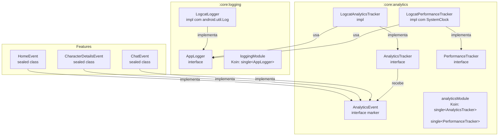

# Core: Observabilidade

O projeto tem dois módulos dedicados a observabilidade: `:core:logging` e `:core:analytics`. Juntos, eles respondem às perguntas mais importantes durante o desenvolvimento e operação do app:

- **O que está acontecendo tecnicamente?** → `:core:logging`
- **O que o usuário está fazendo?** → `:core:analytics`
- **Quanto tempo as operações estão levando?** → `:core:analytics` (PerformanceTracker)

Nenhum dos dois tem dependências externas. Ambos são baseados em interfaces — trocar o backend (ex: adicionar Firebase) significa criar uma nova classe e mudar uma linha no Koin. As features não mudam.

---

## Visão Geral da Arquitetura



O `:core:analytics` depende de `:core:logging` para emitir suas mensagens. As features dependem de ambos para injetar `AppLogger`, `AnalyticsTracker` e `PerformanceTracker`.

---

## `:core:logging` — Diagnóstico Técnico

### O que é

O logging serve ao **engenheiro**. Registra o que acontece internamente: fluxo de dados, erros, estados intermediários. Tudo vai para o Logcat durante o desenvolvimento.

### Interface `AppLogger`

```kotlin
interface AppLogger {
    fun debug(tag: String, message: String)
    fun info(tag: String, message: String)
    fun warn(tag: String, message: String, throwable: Throwable? = null)
    fun error(tag: String, message: String, throwable: Throwable? = null)
}
```

| Nível | Quando usar |
|-------|-------------|
| `debug` | Fluxo de dados, valores intermediários, estados durante desenvolvimento |
| `info` | Operações importantes concluídas (ex: "personagem carregado", "evento registrado") |
| `warn` | Situação inesperada mas recuperável (ex: trace de performance sem startTrace) |
| `error` | Exceção capturada, falha de operação que impacta o usuário |

### Como usar em uma feature

```kotlin
class CharacterDetailsDataSourceImpl(
    private val apiService: CharacterDetailsApiService,
    private val logger: AppLogger
) : CharacterDetailsDataSource {

    override suspend fun getCharacterDetails(id: String): CharacterDetailsData {
        logger.debug(TAG, "Fetching character $id")
        return apiService.getCharacterDetails(id)
    }

    companion object {
        private const val TAG = "CharacterDetailsDataSource"
    }
}
```

```kotlin
// No ViewModel, para logar erros
class HomeViewModel(
    private val getCharactersUseCase: GetCharactersUseCase,
    private val logger: AppLogger
) : ViewModel() {

    private fun onError(e: Exception) {
        logger.error(TAG, "Failed to load characters", e)
        _uiState.value = CharactersUiState.Error(e.message)
    }
}
```

### Registrar no Koin do módulo

```kotlin
// Em :feature:home — homeModule
val homeModule = module {
    factory<CharacterDataSource> { CharacterDataSourceImpl(get(), get()) } // get() resolve AppLogger
    // ...
}
```

O `get()` resolve automaticamente o `AppLogger` registrado pelo `loggingModule` em `:app`.

---

## `:core:analytics` — Eventos de Produto e Performance

### O que é

O analytics serve ao **produto**. Registra o que o usuário faz e quanto tempo as operações levam. Os dados ficam no Logcat agora — a arquitetura está pronta para enviar para Firebase Analytics, Mixpanel ou qualquer backend remoto sem mudar as features.

### Interface `AnalyticsEvent`

Toda ação que vale rastrear é representada como uma classe que implementa `AnalyticsEvent`:

```kotlin
interface AnalyticsEvent {
    val name: String
    val properties: Map<String, String> get() = emptyMap()
}
```

Cada feature declara seus eventos como uma `sealed class` no seu próprio módulo:

```kotlin
// Em :feature:home
sealed class HomeEvent : AnalyticsEvent {

    data class CharacterClicked(val characterId: String) : HomeEvent() {
        override val name = "home_character_clicked"
        override val properties = mapOf("character_id" to characterId)
    }

    data class SearchPerformed(val query: String) : HomeEvent() {
        override val name = "home_search_performed"
        override val properties = mapOf("query" to query)
    }

    object PaginationLoadedNextPage : HomeEvent() {
        override val name = "home_pagination_next_page"
    }
}
```

### Catálogo de Eventos

| Feature | Evento | Propriedades | Significado |
|---------|--------|-------------|-------------|
| Home | `home_character_clicked` | `character_id` | Usuário clicou em um card de personagem |
| Home | `home_search_performed` | `query` | Usuário realizou uma busca |
| Home | `home_pagination_next_page` | — | Paginação carregou a próxima página |
| Character Details | `character_details_screen_opened` | `character_id` | Tela de detalhes foi aberta |
| Character Details | `character_details_episodes_loaded` | `episode_count` | Episódios carregados com sucesso |
| Character Details | `character_details_episodes_load_failed` | — | Falha ao carregar episódios |
| Chat | `chat_message_sent` | — | Usuário enviou uma mensagem |
| Chat | `chat_model_unavailable` | — | Gemini não disponível no dispositivo |
| Chat | `chat_agent_navigation` | `action` | IA acionou navegação agêntica |
| Auth | `auth_login_attempt` | — | `onLoginClicked` chamado — antes da validação |
| Auth | `auth_login_success` | — | Login concluído com sucesso |
| Auth | `auth_login_failure` | — | Qualquer erro de validação ou credencial |
| Auth | `auth_logout` | — | Logout solicitado |

### Interface `AnalyticsTracker`

```kotlin
interface AnalyticsTracker {
    fun track(event: AnalyticsEvent)
}
```

### Como usar em uma feature

```kotlin
class HomeViewModel(
    private val getCharactersUseCase: GetCharactersUseCase,
    private val uiMapper: CharacterUiMapper,
    private val analyticsTracker: AnalyticsTracker
) : ViewModel() {

    fun onCharacterClicked(characterId: String) {
        analyticsTracker.track(HomeEvent.CharacterClicked(characterId))
        // navegação...
    }

    fun onSearchPerformed(query: String) {
        analyticsTracker.track(HomeEvent.SearchPerformed(query))
    }
}
```

Saída no Logcat:
```
I/Analytics: [EVENT] home_character_clicked | character_id=123
I/Analytics: [EVENT] home_search_performed | query=Rick
```

---

## Performance Monitoring

### Interface `PerformanceTracker`

```kotlin
interface PerformanceTracker {
    fun startTrace(name: String)
    fun stopTrace(name: String): Long  // retorna duração em ms
}
```

### Como usar

```kotlin
class CharacterDetailsDataSourceImpl(
    private val apiService: CharacterDetailsApiService,
    private val performanceTracker: PerformanceTracker
) : CharacterDetailsDataSource {

    override suspend fun getCharacterDetails(id: String): CharacterDetailsData {
        performanceTracker.startTrace("character_details_load")
        val result = apiService.getCharacterDetails(id)
        performanceTracker.stopTrace("character_details_load")
        return result
    }
}
```

Saída no Logcat:
```
I/Performance: [PERF] character_details_load: 342ms
```

### Por que `SystemClock.elapsedRealtime()`?

A implementação usa `SystemClock.elapsedRealtime()` — um **clock monotônico**: nunca regride, não é afetado por mudanças de fuso horário ou sincronização NTP. `System.currentTimeMillis()` pode retroceder, gerando medições negativas ou infladas.

O clock é injetável via construtor para facilitar os testes:

```kotlin
class LogcatPerformanceTracker(
    private val logger: AppLogger,
    private val clock: () -> Long = { SystemClock.elapsedRealtime() }
) : PerformanceTracker
```

Nos testes, passa-se um clock fake:

```kotlin
var fakeClock = 0L
val tracker = LogcatPerformanceTracker(logger, clock = { fakeClock })

fakeClock = 100L
tracker.startTrace("op")
fakeClock = 250L
val duration = tracker.stopTrace("op") // 150ms
```

---

## Wiring no Koin

O `loggingModule` precisa ser registrado **antes** do `analyticsModule`, pois o `LogcatAnalyticsTracker` e o `LogcatPerformanceTracker` dependem do `AppLogger`:

```kotlin
// Em :app — Modules.kt
val appModules = listOf(
    loggingModule,     // primeiro — AppLogger disponível
    analyticsModule,   // segundo — resolve AppLogger via get()
    networkModule,
    homeModule,
    characterDetailsModule,
    keysModule,
    chatModule,
    securityModule,
    authModule
)
```

---

## Como Adicionar um Novo Evento

1. Abra o arquivo de eventos da feature (ex: `HomeEvent.kt`)
2. Adicione uma nova subclasse dentro da sealed class:

```kotlin
data class FilterApplied(val filter: String) : HomeEvent() {
    override val name = "home_filter_applied"
    override val properties = mapOf("filter" to filter)
}
```

3. Injete `AnalyticsTracker` no construtor da classe que vai emitir o evento
4. Chame `analyticsTracker.track(HomeEvent.FilterApplied(filter))`
5. Atualize o Koin module da feature para incluir o `AnalyticsTracker` no construtor

Nenhuma mudança nos módulos core é necessária.

---

## Como Trocar o Backend (ex: Firebase Analytics)

1. Adicione a dependência do Firebase no módulo de analytics ou no app
2. Crie a implementação:

```kotlin
class FirebaseAnalyticsTracker(
    private val firebaseAnalytics: FirebaseAnalytics
) : AnalyticsTracker {

    override fun track(event: AnalyticsEvent) {
        firebaseAnalytics.logEvent(event.name) {
            event.properties.forEach { (key, value) -> param(key, value) }
        }
    }
}
```

3. Troque o binding no Koin:

```kotlin
val analyticsModule = module {
    single<AnalyticsTracker> { FirebaseAnalyticsTracker(get()) } // antes: LogcatAnalyticsTracker
    single<PerformanceTracker> { LogcatPerformanceTracker(get()) }
}
```

**Nenhuma feature, ViewModel ou DataSource precisa mudar.**

---

## Observabilidade em Funcionamento — SM-G780F (Android 13)

Saída real do Logcat capturada durante uma sessão no Samsung Galaxy S20 FE. Cobre os três fluxos principais do app.

### Como configurar o filtro no Android Studio

No painel **Logcat**, use o filtro de expressão customizado:

```
tag:HomeViewModel|CharacterDetailsViewModel|ChatViewModel|Analytics|Performance
```

Ou via `adb` na linha de comando:

```bash
adb logcat -s HomeViewModel:D CharacterDetailsViewModel:D ChatViewModel:D Analytics:I Performance:I
```

---

### Cenário 1 — Abertura da Home

```
D HomeViewModel: initialized
D HomeViewModel: loading characters query=''
I Performance: [PERF] home_screen_load: 24ms
I HomeViewModel: home_screen_load: 24ms
```

| Linha | O que significa |
|-------|----------------|
| `initialized` | Koin instanciou o `HomeViewModel` e chamou o `init {}` |
| `loading characters query=''` | Primeira chamada a `getCharacters()` com query vazia |
| `[PERF] home_screen_load: 24ms` | Tempo do `init` até o primeiro `PagingData` ser emitido — **24ms** |
| `home_screen_load: 24ms` | Log de confirmação do próprio ViewModel com a duração retornada pelo trace |

---

### Cenário 2 — Paginação

```
I Analytics: [EVENT] home_pagination_next_page
I Analytics: [EVENT] home_pagination_next_page
```

Cada linha corresponde a um scroll até o fim da lista. O evento é disparado pela `HomeScreen` quando o `loadState.append` transita de `Loading` para `NotLoading` — ou seja, quando uma nova página foi efetivamente recebida da API.

---

### Cenário 3 — Click em personagem → Tela de Detalhes

```
I Analytics: [EVENT] home_character_clicked | character_id=27
I Analytics: [EVENT] character_details_screen_opened | character_id=27
D CharacterDetailsViewModel: loading character id=27
I Performance: [PERF] character_details_load: 75ms
I CharacterDetailsViewModel: character 27 loaded in 75ms
I Performance: [PERF] episodes_fetch: 177ms
I CharacterDetailsViewModel: episodes loaded count=2 in 177ms
I Analytics: [EVENT] character_details_episodes_loaded | episode_count=2
```

| Linha | O que significa |
|-------|----------------|
| `home_character_clicked` | Click capturado na `HomeScreen` antes da navegação |
| `character_details_screen_opened` | `CharacterDetailsViewModel` recebeu o `id` e emitiu o evento de abertura |
| `loading character id=27` | Requisição à API iniciada |
| `[PERF] character_details_load: 75ms` | Tempo de resposta da API de detalhes do personagem |
| `[PERF] episodes_fetch: 177ms` | Tempo da requisição secundária de episódios (operação independente) |
| `character_details_episodes_loaded \| episode_count=2` | Personagem 27 aparece em 2 episódios |

Os dois traces (`character_details_load` e `episodes_fetch`) são **independentes** — o personagem é exibido assim que o primeiro termina; os episódios chegam depois sem bloquear a UI.

---

### Cenário 4 — Chat + Navegação Agentica

```
D ChatViewModel: checking model availability
I ChatViewModel: model available
I Analytics: [EVENT] chat_message_sent
D ChatViewModel: sending message length=21
I Performance: [PERF] chat_response_time: 2891ms
I ChatViewModel: response received in 2891ms
I Analytics: [EVENT] chat_agent_navigation | action=open_character
I Analytics: [EVENT] character_details_screen_opened | character_id=1
D CharacterDetailsViewModel: loading character id=1
I Performance: [PERF] character_details_load: 79ms
I CharacterDetailsViewModel: character 1 loaded in 79ms
I Performance: [PERF] episodes_fetch: 123ms
I CharacterDetailsViewModel: episodes loaded count=51 in 123ms
I Analytics: [EVENT] character_details_episodes_loaded | episode_count=51
```

| Linha | O que significa |
|-------|----------------|
| `checking model availability` | `CheckModelAvailabilityUseCase` chamado no `init` do ViewModel |
| `model available` | Gemini respondeu; estado muda para `Conversation` |
| `chat_message_sent` | Evento disparado **antes** da chamada à API — captura a intenção do usuário |
| `sending message length=21` | 21 caracteres enviados ao modelo |
| `[PERF] chat_response_time: 2891ms` | Gemini levou **2,9 segundos** para responder |
| `chat_agent_navigation \| action=open_character` | O modelo acionou a tool `show_character` — navegação agentica disparada |
| `character_details_screen_opened \| character_id=1` | Rick Sanchez (id=1) aberto automaticamente pelo agente |
| `episode_count=51` | Rick aparece em 51 episódios — confirmação que a cadeia toda funcionou |

O fluxo de navegação agentica é visível no Logcat como uma sequência direta: `chat_agent_navigation` → `character_details_screen_opened` → dados carregados. Nenhuma ação manual do usuário entre esses eventos.

---

## Decisões Arquiteturais

| ADR | Decisão |
|-----|---------|
| [ADR-011](https://github.com/sabinabernardes/RickAndMorty/blob/master/.claude/adrs/ADR-011-dois-modulos-logging-analytics.md) | Dois módulos separados vs um único `:core:observability` |
| [ADR-012](https://github.com/sabinabernardes/RickAndMorty/blob/master/.claude/adrs/ADR-012-interface-first-sem-deps-externas.md) | Interface-first sem dependências externas |
| [ADR-013](https://github.com/sabinabernardes/RickAndMorty/blob/master/.claude/adrs/ADR-013-analytics-event-sealed-class.md) | `AnalyticsEvent` como sealed class por feature |
| [ADR-014](https://github.com/sabinabernardes/RickAndMorty/blob/master/.claude/adrs/ADR-014-performance-tracking-systemclock.md) | Performance tracking com `SystemClock.elapsedRealtime()` |
| [ADR-015](https://github.com/sabinabernardes/RickAndMorty/blob/master/.claude/adrs/ADR-015-viewmodel-como-camada-de-observabilidade-nas-features.md) | ViewModel como camada primária de integração nas features |
| [ADR-016](https://github.com/sabinabernardes/RickAndMorty/blob/master/.claude/adrs/ADR-016-convencao-performance-traces-nas-features.md) | Convenção `feature_operação` para nomes de performance trace |