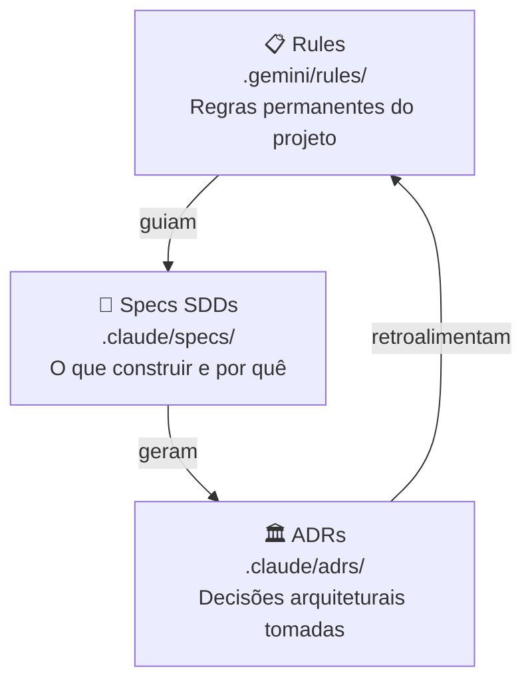
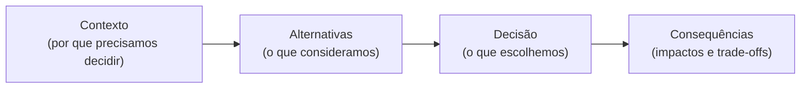

# Documentação de Engenharia

Este projeto mantém três camadas de documentação técnica versionadas junto com o código, dentro da pasta `.claude/` e `.gemini/rules/`. Cada camada tem um propósito diferente.

---

## 📋 Rules — Regras permanentes

As rules ficam em `.gemini/rules/` e definem os padrões que **todo o código deve seguir sempre**, independente da feature. São lidas por ferramentas de IA (Gemini, Claude) para garantir consistência automática nas sugestões de código.

| Arquivo | O que define |
|---------|-------------|
| `ARCHITECTURE.md` | Clean Architecture obrigatória, separação de camadas, módulos por feature |
| `TESTING.md` | JUnit 4 + MockK, padrão Given-When-Then, `runTest` para coroutines |
| `COROUTINES.md` | Nunca hardcodar dispatchers, usar `viewModelScope`, preferir `StateFlow` |
| `DESIGN_SYSTEM.md` | Apenas tokens do design system — zero valores hardcodados em features |

**Exemplo prático:** a rule `DESIGN_SYSTEM.md` impede que um dev escreva `padding(16.dp)` diretamente — o correto é `padding(SpacingTokens.spacing16)`. Isso garante que uma mudança no token propague para todo o app.

---

## 📄 Specs — O que construir

As specs ficam em `.claude/specs/` e documentam features **antes e durante** a implementação. Cada feature tem pelo menos um **SDD (Software Design Document)**, e features maiores têm também **DoR** e **DoD**.

| Tipo | Significado | Quando é criado |
|------|-------------|-----------------|
| **SDD** | Software Design Document — o quê, como e por quê implementar | Antes de começar a feature |
| **DoR** | Definition of Ready — critérios para a feature estar pronta para implementar | Junto com o SDD |
| **DoD** | Definition of Done — critérios para considerar a feature concluída | Junto com o SDD |

### Specs existentes

| Spec | Feature | Status |
|------|---------|--------|
| `chat-feature-sdd.md` | Chat com IA — Gemini API direto | Implementado |
| `agentic-chat-sdd.md` | Chat Agêntico — IA abre telas do app | Implementado |
| `core-logging-sdd.md` | Módulo de logging estruturado | Implementado |
| `core-analytics-sdd.md` | Módulo de analytics e performance | Implementado |
| `feature-observability-integration-sdd.md` | Integração de observabilidade nas features | Implementado |
| `ci-cd-quality-gates-sdd.md` | Pipeline CI/CD com Detekt, JaCoCo e auto-merge | Implementado |
| `ui-testing-strategy-sdd.md` | Estratégia de testes de UI com Robolectric e Roborazzi | Implementado |
| `screenshot-testing-paparazzi-vs-roborazzi-sdd.md` | Análise Paparazzi vs Roborazzi | Implementado |
| `episode-list-details-sdd.md` | Lista de episódios na tela de detalhes | Planejado |
| `design-system-polish-sdd.md` | Polish do design system e animações de entrada | Planejado |

---

## 🏛 ADRs — Decisões arquiteturais

ADRs (Architecture Decision Records) documentam **decisões técnicas importantes que foram tomadas**, incluindo o contexto, as alternativas consideradas e o motivo da escolha. São imutáveis — uma decisão revista não apaga a anterior, gera um novo ADR.

### ADRs do projeto

| ADR | Decisão | Módulo |
|-----|---------|--------|
| [ADR-001](https://github.com/sabinabernardes/RickAndMorty/blob/master/.claude/adrs/ADR-001-escolha-provedor-ia.md) | Escolha do provedor de IA: ML Kit Gemini Nano (on-device) | `:feature:chat` |
| [ADR-002](https://github.com/sabinabernardes/RickAndMorty/blob/master/.claude/adrs/ADR-002-ciclo-vida-generativemodel.md) | `GenerativeModel` como `single` no Koin (não `factory`) | `:feature:chat` |
| [ADR-003](https://github.com/sabinabernardes/RickAndMorty/blob/master/.claude/adrs/ADR-003-persona-no-repository.md) | Persona do Rick concatenada no `ChatRepositoryImpl` | `:feature:chat` |
| [ADR-004](https://github.com/sabinabernardes/RickAndMorty/blob/master/.claude/adrs/ADR-004-design-chatuistate.md) | `ChatUiState` unificado com `Conversation` como estado principal | `:feature:chat` |
| [ADR-005](https://github.com/sabinabernardes/RickAndMorty/blob/master/.claude/adrs/ADR-005-sem-core-network.md) | `:feature:chat` não depende de `:core:network` | `:feature:chat` |
| [ADR-006](https://github.com/sabinabernardes/RickAndMorty/blob/master/.claude/adrs/ADR-006-pivot-gemini-api-direto.md) | **Pivot:** substituição do ML Kit pelo Gemini API direto com `BuildConfig` | `:feature:chat` |
| [ADR-007](https://github.com/sabinabernardes/RickAndMorty/blob/master/.claude/adrs/ADR-007-episodes-inside-character-details-module.md) | Episódios dentro de `:feature:character_details`, sem novo módulo | `:feature:character_details` |
| [ADR-008](https://github.com/sabinabernardes/RickAndMorty/blob/master/.claude/adrs/ADR-008-multi-id-episode-request.md) | Busca de múltiplos episódios em uma única request | `:feature:character_details` |
| [ADR-009](https://github.com/sabinabernardes/RickAndMorty/blob/master/.claude/adrs/ADR-009-incremental-loading-episodes.md) | Carregamento incremental: personagem primeiro, episódios depois | `:feature:character_details` |
| [ADR-010](https://github.com/sabinabernardes/RickAndMorty/blob/master/.claude/adrs/ADR-010-api-single-object-vs-array.md) | Tratamento do quirk da API: resposta como objeto único ou array | `:feature:character_details` |
| [ADR-011](https://github.com/sabinabernardes/RickAndMorty/blob/master/.claude/adrs/ADR-011-dois-modulos-logging-analytics.md) | Dois módulos separados: `:core:logging` e `:core:analytics` | `:core` |
| [ADR-012](https://github.com/sabinabernardes/RickAndMorty/blob/master/.claude/adrs/ADR-012-interface-first-sem-deps-externas.md) | Interface-first sem dependências externas nos módulos core | `:core` |
| [ADR-013](https://github.com/sabinabernardes/RickAndMorty/blob/master/.claude/adrs/ADR-013-analytics-event-sealed-class.md) | `AnalyticsEvent` como sealed class por domínio de feature | `:core:analytics` |
| [ADR-014](https://github.com/sabinabernardes/RickAndMorty/blob/master/.claude/adrs/ADR-014-performance-tracking-systemclock.md) | Performance tracking com `SystemClock.elapsedRealtime()` | `:core:analytics` |
| [ADR-015](https://github.com/sabinabernardes/RickAndMorty/blob/master/.claude/adrs/ADR-015-viewmodel-como-camada-de-observabilidade-nas-features.md) | ViewModel como camada primária de observabilidade nas features | Features |
| [ADR-016](https://github.com/sabinabernardes/RickAndMorty/blob/master/.claude/adrs/ADR-016-convencao-performance-traces-nas-features.md) | Convenção `feature_operação` para nomes de performance trace | Features |
| [ADR-017](https://github.com/sabinabernardes/RickAndMorty/blob/master/.claude/adrs/ADR-017-homemodule-dentro-do-feature-home.md) | `homeModule` Koin declarado dentro de `:feature:home` | `:feature:home` |
| [ADR-018](https://github.com/sabinabernardes/RickAndMorty/blob/master/.claude/adrs/ADR-018-debounce-search-no-viewmodel.md) | Debounce de busca e analytics de `SearchPerformed` no ViewModel | `:feature:home` |
| [ADR-019](https://github.com/sabinabernardes/RickAndMorty/blob/master/.claude/adrs/ADR-019-ci-gate-obrigatorio-antes-do-auto-merge.md) | CI gate obrigatório antes do auto-merge | CI/CD |
| [ADR-020](https://github.com/sabinabernardes/RickAndMorty/blob/master/.claude/adrs/ADR-020-detekt-analise-estatica-kotlin.md) | Detekt para análise estática Kotlin em todos os módulos | CI/CD |
| [ADR-021](https://github.com/sabinabernardes/RickAndMorty/blob/master/.claude/adrs/ADR-021-coverage-gate-jacoco.md) | Coverage gate obrigatório ≥ 60% via JaCoCo | CI/CD |
| [ADR-022](https://github.com/sabinabernardes/RickAndMorty/blob/master/.claude/adrs/ADR-022-paralelismo-jobs-ci.md) | Jobs paralelos no CI: static-analysis e test independentes | CI/CD |
| [ADR-023](https://github.com/sabinabernardes/RickAndMorty/blob/master/.claude/adrs/ADR-023-roborazzi-screenshot-testing.md) | Roborazzi para screenshot testing (vs Paparazzi) | Testes |
| [ADR-024](https://github.com/sabinabernardes/RickAndMorty/blob/master/.claude/adrs/ADR-024-feature-auth-simulada.md) | Autenticação simulada com JWT mock e EncryptedSharedPreferences | `:feature:auth` |

### ADR em destaque: ADR-006 — O pivot do ML Kit para Gemini API

O ADR-006 é o mais relevante para entender a arquitetura atual do chat. O plano original usava **Gemini Nano on-device** (ML Kit) — sem internet, processamento local no dispositivo. Após testes no Samsung Galaxy Z Flip 6, o AICore não era suportado pelo aparelho.

A decisão foi pivotar para **Gemini 2.5 Flash via API direta**, com a chave armazenada em `local.properties` e injetada via `BuildConfig` — mais simples, compatível com qualquer dispositivo Android com internet, e sem custo de latência de download de modelo.

---

> Para o contexto de escala e referências oficiais do Google, veja a página [Arquitetura](Arquitetura).
